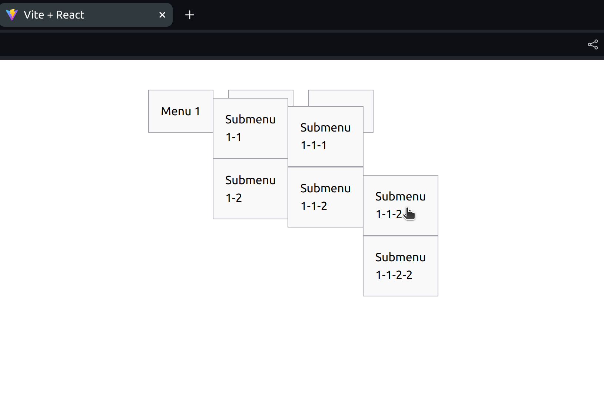

# React + Vite

This template provides a minimal setup to get React working in Vite with HMR and some ESLint rules.

Currently, two official plugins are available:

- [@vitejs/plugin-react](https://github.com/vitejs/vite-plugin-react/blob/main/packages/plugin-react/README.md) uses [Babel](https://babeljs.io/) for Fast Refresh
- [@vitejs/plugin-react-swc](https://github.com/vitejs/vite-plugin-react-swc) uses [SWC](https://swc.rs/) for Fast Refresh

This is an example of a nested menu created using React. The menu consists of multiple levels of nested items, allowing for a hierarchical structure. Each item can be expanded or collapsed to reveal or hide its sub-items.

The menu is implemented using React components and utilizes the Vite development server for hot module replacement (HMR). Two official plugins, [@vitejs/plugin-react](https://github.com/vitejs/vite-plugin-react/blob/main/packages/plugin-react/README.md) and [@vitejs/plugin-react-swc](https://github.com/vitejs/vite-plugin-react-swc), are used to enable Fast Refresh functionality.

Feel free to explore the code and customize it according to your needs!